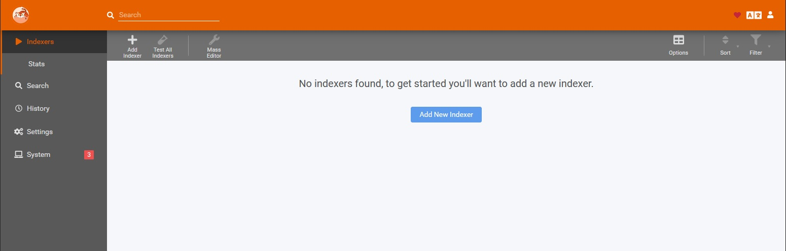

<!--
N.B.: This README was automatically generated by https://github.com/YunoHost/apps/tree/master/tools/README-generator
It shall NOT be edited by hand.
-->

# Prowlarr for YunoHost

[](https://dash.yunohost.org/appci/app/prowlarr)    
[](https://install-app.yunohost.org/?app=prowlarr)

*[Lire ce readme en français.](./README_fr.md)*

> *This package allows you to install Prowlarr quickly and simply on a YunoHost server.
If you don't have YunoHost, please consult [the guide](https://yunohost.org/#/install) to learn how to install it.*

## Overview

Complete management of your indexers for Radarr, Sonarr, Lidarr, ...

**Shipped version:** 0.1.10.1375~ynh1

## Screenshots



## Disclaimers / important information

* Supported architectures are `arm`, `arm64`, and `amd64`
* Access control is done with YunoHost's permissions system.
  * API (`domain.tld/path/api`) can be accessed by visitors to allow control by remote clients.

## Documentation and resources

* Official app website: <https://prowlarr.com>
* Official admin documentation: <https://wiki.servarr.com/prowlarr>
* Upstream app code repository: <https://github.com/Prowlarr/Prowlarr>
* YunoHost documentation for this app: <https://yunohost.org/app_prowlarr>
* Report a bug: <https://github.com/YunoHost-Apps/prowlarr_ynh/issues>

## Developer info

Please send your pull request to the [testing branch](https://github.com/YunoHost-Apps/prowlarr_ynh/tree/testing).

To try the testing branch, please proceed like that.

``` bash
sudo yunohost app install https://github.com/YunoHost-Apps/prowlarr_ynh/tree/testing --debug
or
sudo yunohost app upgrade prowlarr -u https://github.com/YunoHost-Apps/prowlarr_ynh/tree/testing --debug
```

**More info regarding app packaging:** <https://yunohost.org/packaging_apps>
